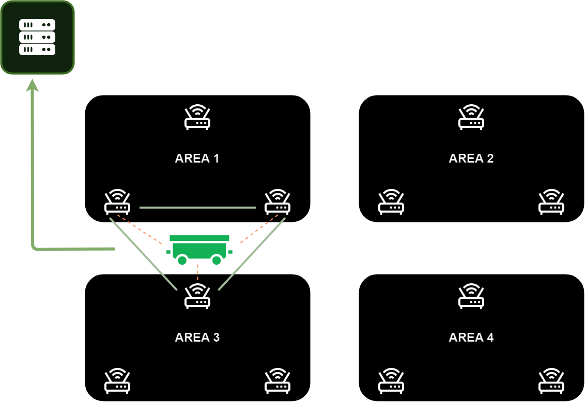

<h1 align="center">
    
</h1>

# Projeto JDUBER 

## Introdução

O projeto foi desenvolvido para resolver a necessidade de localização eficiente de plataformas móveis na fábrica da John Deere. Esse problema afeta a operação industrial ao dificultar a logística e movimentação de equipamentos, levando a atrasos e ineficiências.

O objetivo deste projeto é desenvolver uma solução integrada baseada na Internet das Coisas (IoT) para otimizar o rastreamento e o gerenciamento logístico dos carrinhos plataforma na fábrica da John Deere. Utilizando o módulo ESP32, o sistema permitirá o monitoramento em tempo real dos carrinhos, enviando dados de localização para um servidor Django. A partir dessa infraestrutura, os operadores poderão visualizar as posições dos carrinhos e gerenciar solicitações de movimentação por meio de uma interface gráfica web, proporcionando maior agilidade e eficiência nas operações logísticas internas.
  

## Desenvolvimento

Este projeto é composto por dois sistemas principais que trabalham de forma integrada: um sistema de hardware ESP32 para monitoramento dos carrinhos e um sistema de aplicação web para que os operadores possam interagir e visualizar as informações coletadas.

### Sistema de Monitoramento com ESP32

#### Arquitetura do Sistema

O sistema de monitoramento é responsável pela coleta de dados sobre a localização dos carrinhos na fábrica. Ele é composto por:

1. **ESP32**: Um microcontrolador com conexão WiFi que identifica e envia a posição dos carrinhos utilizando triangulação de sinais WiFi.
2. **Servidor Django**: Um servidor backend que recebe os dados de localização enviados pelo ESP32. Ele processa e armazena essas informações, tornando-as disponíveis para a aplicação web.

#### Funcionamento

<h1 align="center">
    
</h1>

#### Tecnologias Utilizadas

- **Arduino IDE**: Utilizado para programar o ESP32 e garantir que ele se comunique com o servidor.
- **Django (Python Framework)**: Gerencia o servidor backend, processando e armazenando os dados de localização recebidos do ESP32.
- **Python/C++**: A lógica de comunicação entre o ESP32 e o servidor é escrita em Python e C++, possibilitando o envio dos dados de localização via WiFi.

### Sistema de Aplicação Web para Operadores

#### Arquitetura do Sistema

A aplicação web é a interface que os operadores utilizam para visualizar e interagir com os dados de monitoramento dos carrinhos. Ela é composta por:

1. **Interface Gráfica do Usuário (GUI)**: Permite que os operadores façam solicitações de movimentação dos carrinhos ou verifiquem informações em tempo real sobre o status dos mesmos. 
2. **Lógica de Ações e Tabela de Dados**: Este sistema processa as interações dos operadores e exibe as informações detalhadas sobre o status dos carrinhos, incluindo o tipo de item transportado, a área onde o carrinho está localizado, e seu status atual (por exemplo, "PENDENTE", "CONCLUÍDO", ou "EM ANDAMENTO").

#### Funcionamento

Logo a baixo, segue um vídeo de apresentação do site.

<h1 align="center">
    
</h1>

- **Interface Gráfica (GUI)**: Sempre que um operador precisar gerenciar ou visualizar os carrinhos, ele abrirá o aplicativo gráfico. O aplicativo foi desenvolvido com a biblioteca **Tkinter**, que permite criar janelas, botões, e tabelas fáceis de usar.

  - **Botão "Solicitar"**: Este botão é usado para registrar solicitações de movimentação. Quando o operador clica no botão, o sistema responde registrando a solicitação.
  
  - **Botão "Manuseio"**: Ao clicar neste botão, uma tabela é exibida com informações detalhadas dos carrinhos, permitindo ao operador visualizar a situação e o progresso de cada carrinho.

- **Exibição da Tabela**: A tabela exibe informações como o tipo de item que o carrinho transporta, a área em que ele se encontra e o status de sua operação. Isso facilita para o operador acompanhar o andamento das movimentações e tomar decisões com base nas informações exibidas.

#### Tecnologias Envolvidas

1. **HTML**: Linguagem de marcação usada para estruturar o conteúdo de páginas web, ela define a hierarquia e o layout de uma página (títulos, parágrafos, imagens, links, etc.).
2. **CSS**: Linguagem de estilo usada para controlar a aparência de páginas web, ela é responsável por estiliza o HTML, controlando layout, cores, fontes, espaçamentos, e outros aspectos visuais.
3. **PHP**: Linguagem de programação do lado do servidor usada para criar conteúdo dinâmico em páginas web, gera HTML dinamicamente, conecta-se a bancos de dados, e manipula entradas de usuários.

---

Dessa forma, o sistema garante o monitoramento eficiente dos carrinhos na fábrica, integrando o hardware de coleta de dados (ESP32) com uma interface gráfica amigável para os operadores, permitindo que eles visualizem e gerenciem a logística de maneira eficaz.

## Resultados

A aplicação entrega os seguintes resultados:

- A localização em tempo real do carrinho plataforma é mostrada em um mapa na interface web.
- Os dados de localização são atualizados a cada X segundos, permitindo um monitoramento preciso.
